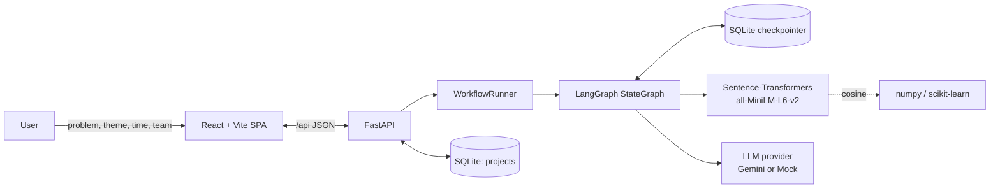
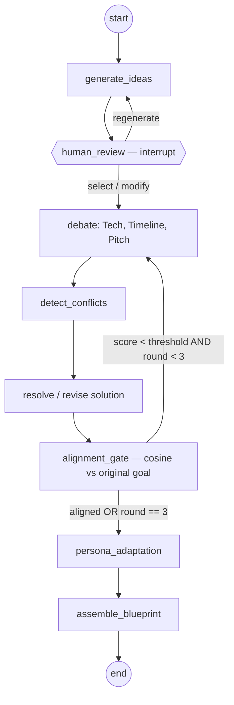

# Architecture

Technical companion to the [README](./README.md): how the system is built, and how it is measured.

## 1. System overview



The frontend is a single-page stage stepper. The backend wraps a LangGraph state machine in a `WorkflowRunner`; the graph holds the single source of truth for a project's evolving state and is persisted through a SQLite checkpointer keyed by `thread_id = project_id`. Embeddings and cosine similarity are pure numeric code. The LLM is only ever asked to produce structured, schema-validated JSON.

## 2. The graph



**Human review is a real LangGraph `interrupt()`.** The graph halts and the runner returns control to the API; the run resumes only when the user posts a `select`, `modify`, or `regenerate` decision, delivered back into the graph as `Command(resume=...)`. Nothing is auto-selected.

**The alignment gate is the only loop**, and it is bounded twice over: it re-enters debate only while `alignment_score < threshold` **and** `debate_round < MAX_DEBATE_ROUNDS`. When the solution converges, or the third round completes, it proceeds to persona adaptation and emits a controlled result. No path can loop without consuming a round.

## 3. Workflow state

One typed state object flows through the graph — no loose variables between nodes.

```
problem_statement, hackathon_theme, time_limit_hours, team_profile   # inputs
candidate_ideas, selected_idea                                      # idea + HITL
tech_analysis, timeline_analysis, pitch_analysis                    # debate
conflicts, revision_directives, debate_round                        # conflict / resolve
alignment_score, alignment_status, alignment_history                # gate
final_plan, persona_adapted_plan                                    # outputs
usage_log                                                           # per-call token + latency records
```

`usage_log` gains one record per LLM call (`input_tokens`, `output_tokens`, `latency_ms`); run metrics are summed from it deterministically. `alignment_history` keeps every round's cosine score so the UI can draw the convergence trace.

## 4. Conflict detection (deterministic)

The arbiter compares the three analyses against each other and against the original requirements for concrete tensions — a stack whose scope implies heavy build time against a timeline flagged as not-fit, a pitch promising capability the tech scope does not cover, a solution drifting from the stated problem. Each conflict carries a severity and a resolution directive that feeds the next revision. This is plain Python; the LLM is never asked "are these in conflict?", and conflicts are never manufactured to demonstrate the feature.

## 5. Semantic alignment (deterministic)

```
original problem statement ──embed──▶ vector A
current solution summary   ──embed──▶ vector B
cosine(A, B) ─────────────────────────▶ alignment_score ∈ [0,1]
```

Embeddings use `all-MiniLM-L6-v2`, lazy-loaded and cached. Cosine similarity is computed with numpy/scikit-learn — zero tokens, fully reproducible. The score is compared to `ALIGNMENT_THRESHOLD` (default `0.75`); status is `aligned`, `drift` (below threshold, will re-debate), or `max_rounds_exceeded` (stopped at the cap). The identical routine scores the baseline plan, so both arms of the evaluation are measured the same way.

## 6. Persona adaptation

One LLM call re-expresses the converged plan for the requested skill level, changing explanation complexity, terminology, technical depth, and hand-holding — never the stack, architecture, timeline, or scope. The persona endpoint is non-mutating, which is what lets the UI show beginner / intermediate / advanced side by side without re-running the pipeline.

## 7. API and persistence

FastAPI serves the routes listed in the README under `/api/projects`, wrapped by CORS middleware, structured logging, and an `AppError → JSON` exception handler; `init_db()` runs at startup. Two SQLite stores are kept separate by concern:

- **`projects`** (SQLAlchemy) — durable records: id, problem statement, theme, time limit, preferences, team members (JSON), status, cached baseline (JSON), timestamps.
- **LangGraph checkpointer** — evolving graph state per project, which is what makes interrupt/resume work across separate HTTP requests.

Checkpointed values can return as either Pydantic models or plain dicts, so the API layer normalizes them through defensive dump/parse helpers before serializing.

## 8. Token-saving strategy

LLM calls are the scarce resource. Idea generation is one call capped at 3 ideas. Each debate round is 3 focused agent calls plus 1 revision call, capped at 3 rounds. Persona adaptation is 1 call; the baseline is 1 call. Everything else — conflict detection, routing, round counting, cosine similarity, timeline arithmetic, validation, persistence — is deterministic code. Prompts are concise, outputs are structured JSON validated by Pydantic, each agent receives only the relevant slice of state rather than full transcripts or every other agent's complete output, and unchanged outputs are reused rather than regenerated.

Worst case for a full run: `1 (ideas) + 3 × (3 + 1) (debate rounds) + 1 (persona) = 14` calls, against `1` for the baseline — a bound the evaluation reports openly rather than hiding.

## 9. Evaluation strategy

The pipeline is compared against a single-shot baseline (`User Input → one LLM call → plan`) on the same problem:

- **Efficiency** — LLM calls, input/output/total tokens, latency, debate rounds.
- **Debate effectiveness** — conflicts detected and resolved (zero by construction for the baseline).
- **Alignment** — final cosine alignment of each plan to the original goal, scored by the same embedding routine.
- **Persona adaptation** — the three skill levels of the same plan, rendered for comparison.

All figures come from real executions. Comparison notes suppress ratios that would divide by zero and mark alignment `n/a` unless both scores exist. No claim of superiority is asserted ahead of the measured data.

## 10. Technical risks and mitigations

The heaviest dependency is `sentence-transformers`/torch: it inflates image size and needs a one-time model download — mitigated by lazy loading, caching, and a deterministic mock provider for offline and CI runs. LangGraph checkpoint round-trips vary between model and dict shapes — mitigated by the normalization helpers. The re-debate loop is a deliberate infinite-loop risk — mitigated by the dual threshold-and-round bound with a hard cap of 3. Cost is bounded by the per-stage call caps and surfaced live, so regressions are visible immediately.
